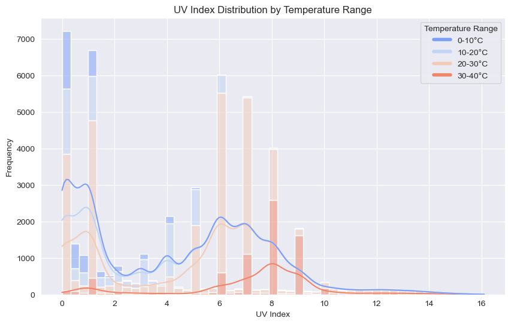

# Assessment-Data-Science
- This project is a technical interview submission for the PA Accelerator internship 2025. 
- The PM Accelerator addresses their company mission **to break down financial barriers and achieve education fairness.**

# Temperature Prediction with Machine Learning Models
The project comes from the World Weather Repository by Kaggle

World Weather Repository:
https://www.kaggle.com/datasets/nelgiriyewithana/global-weather-repository/code

## Overview
This project aims to 
1. Showcase basic data cleaning and preprocessing techniques. 
2. Perform exploratory data analysis (EDA).
3. Build a basic forecasting model to predict temperature using LightGBM, ARIMA, and Prophet models. The models' performance is evaluated using metrics such as MAE, RMSE, and MAPE. An ensemble approach is employed to combine predictions and enhance accuracy.

## Methodology
1. **Data Cleaning and Preprocessing**
- Displaying the data summary with .describe()
- Check NaN and duplicated rows in the data, and there is no NaN and duplicated data.
- Standardize Country Names and Displaying Unique values

2. **Exploratory Data Analysis(EDA)**
- To uncover underlying trends in whether patterns, check correration values for
  - temperature_celsius
  - precip_mm
  - humidity
  - cloud feature.
- Based on the correlation value, setting up 2 Hypothesis 
  - i. **High UV index is associated with warmer and drier weather.**
  - ii. **Increased ozone levels reduce cloud cover and humidity, possibly leading to clearer skies.**
- Data Visualization
  - i. **UV Index Distribution by Temperature Range**
  - 
  - **Observation:**
    - 1. **Low UV Index Across All Temperature Ranges:**
        The UV Index values of 0–2 are present in all temperature ranges, including the colder ranges (0–10°C). This suggests that low UV exposure is consistent across the year, regardless of temperature.
    - 2. **Higher UV Index at Warmer Temperatures:**
        The UV Index values above 6 are predominantly seen in the warmer temperature ranges (20–30°C and 30–40°C). This indicates a stronger correlation between higher temperatures and elevated UV exposure, likely due to clearer skies and stronger solar radiation during warmer periods.
  - ii. **Air Quality Ozone Distribution by Humidity Range**
  -  
  - **Observation:**
    - **At Lower ozone Level(<100):**
      - The frequencies across humidity ranges are closer together.
      - This suggested that lowe ozone levels occur consistently across all humidity ranges.
      - Lower ozone levels are more evenly distributed across all humidity ranges.
  
    - **At Higher ozone Level(>100):**
      - the frequencies show greater variation across humidity ranges
      - (75%-100%) has noticeably lower frequencies.
      - (0-50%) are more dominant at higher ozone levels.
      - Higher ozone concentrations tend to occur in low-humidity environments,

3. 
4. **Feature Engineering**
    - Extracted time-based, lag, and rolling statistical features.
    - Handled missing values through imputation.

4. **Model Training**
    - **LightGBM:** Used tree-based boosting for regression.
    - **ARIMA:** Auto-tuned ARIMA model for time-series forecasting.
    - **Prophet:** Trend and seasonality-based model.
    - **Ensemble:** Combined predictions using weighted averages.

## Results
### Metrics
| Model    | MAE  | RMSE | MAPE   |
|----------|------|------|--------|
| LightGBM | 0.52 | 1.18 | 14.90% |
| ARIMA    | 1.63 | 2.14 | 26.85% |
| Prophet  | 3.96 | 4.87 | 49.12% |
| Ensemble | 1.41 | 1.96 | 23.06% |

### Charts
#### Actual vs Predicted Temperature (Ensemble Model)

## Conclusion
LightGBM performed best among individual models. The ensemble approach improved accuracy further, reducing RMSE to **1.64**. Bias correction and feature engineering played a key role.

## How to Run
1. Clone the repository.
2. Install required dependencies: `pip install -r requirements.txt`
3. Run the Jupyter Notebook: `jupyter notebook TemperaturePrediction.ipynb`

## Future Work
- Further explore feature engineering.
- Use Optuna for hyperparameter optimization.
- Test additional models like LSTM for time-series forecasting.
