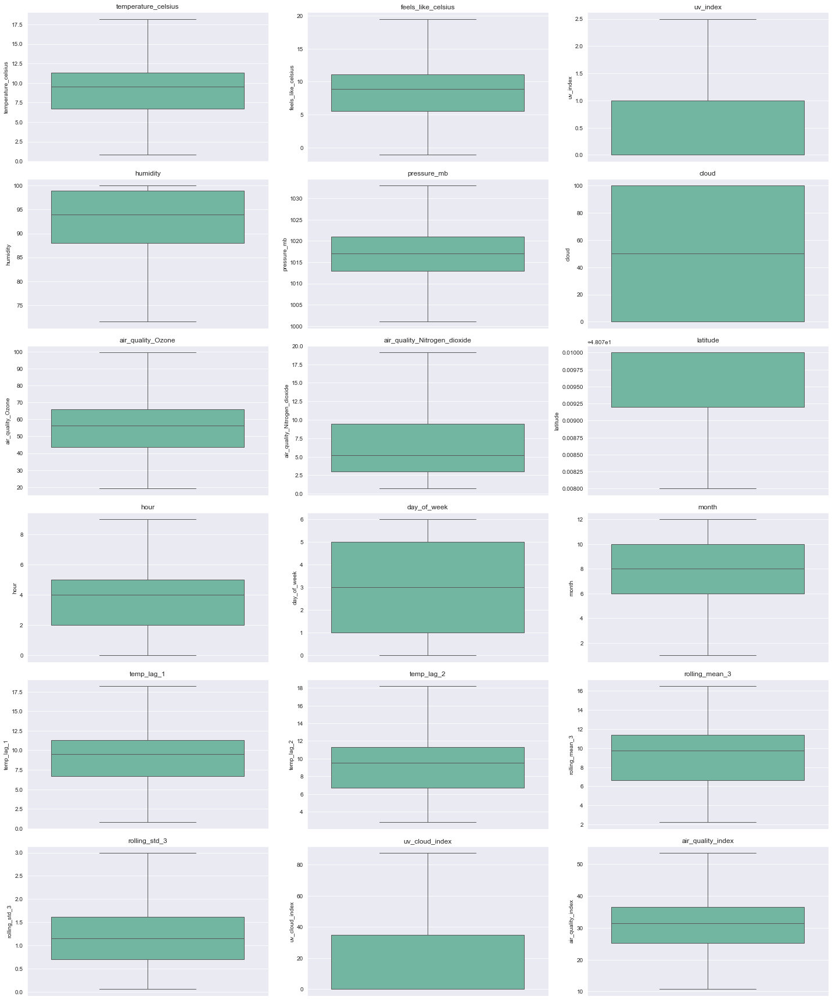

# Assessment-Data-Science
- This project is a technical interview submission for the PA Accelerator internship 2025. 
- The PM Accelerator addresses their company mission **to break down financial barriers and achieve education fairness.**

# Temperature Prediction with Machine Learning Models
The project comes from the World Weather Repository by Kaggle

World Weather Repository:
https://www.kaggle.com/datasets/nelgiriyewithana/global-weather-repository/code

## Overview
This project aims to 
1. Showcase basic data cleaning and preprocessing techniques. 
2. Perform exploratory data analysis (EDA).
3. Build a basic forecasting model to predict temperature using LightGBM, ARIMA, and Prophet models. The models' performance is evaluated using metrics such as MAE, RMSE, and MAPE. An ensemble approach is employed to combine predictions and enhance accuracy.

## Methodology
### Step 1. Data Cleaning and Preprocessing
- Displaying the data summary with .describe()
- Check NaN and duplicated rows in the data, and there is no NaN and duplicated data.
- Standardize Country Names and Displaying Unique values

### Step 2. Exploratory Data Analysis(EDA)
- To uncover underlying trends in whether patterns, check correlation values for
  - temperature_celsius
  - precip_mm
  - humidity
  - cloud feature.

- Based on the correlation value, setting up 2 Hypothesis 
  - i. **High UV index is associated with warmer and drier weather.**
  - ii. **Increased ozone levels reduce cloud cover and humidity, possibly leading to clearer skies.**

- Data Visualization
  - i. **UV Index Distribution by Temperature Range**
    
    - **Observation:**
      - 1. **Low UV Index Across All Temperature Ranges:**
          The UV Index values of 0–2 are present in all temperature ranges, including the colder ranges (0–10°C). This suggests that low UV exposure is consistent across the year, regardless of temperature.
      - 2. **Higher UV Index at Warmer Temperatures:**
          The UV Index values above 6 are predominantly seen in the warmer temperature ranges (20–30°C and 30–40°C). This indicates a stronger correlation between higher temperatures and elevated UV exposure, likely due to clearer skies and stronger solar radiation during warmer periods.
      
  - ii. **Air Quality Ozone Distribution by Humidity Range**
     
    - **Observation:**
      - **At Lower ozone Level(<100):**
        - The frequencies across humidity ranges are closer together.
        - This suggested that lowe ozone levels occur consistently across all humidity ranges.
        - Lower ozone levels are more evenly distributed across all humidity ranges.
  
      - **At Higher ozone Level(>100):**
        - the frequencies show greater variation across humidity ranges
        - (75%-100%) has noticeably lower frequencies.
        - (0-50%) are more dominant at higher ozone levels.
        - Higher ozone concentrations tend to occur in low-humidity environments,
        
  - iii. **Generate visualizations for temperature and precipitation**
    - Individual Visualization 
      
  
      
    
    - Relationship Between Temperature and Precipitation
      
  
      
        - **Observation:**
          - **Temperature Distribution:** The temperature data follows a normal distribution, primarily ranging between 0°C and 40°C, with a peak around 20°C to 30°C. This indicates that most temperatures are in a moderate to warm range, which is expected in many climates.
          - **Precipitation:** The majority of precipitation values are concentrated between 0.0mm and 0.5mm, indicating predominantly dry conditions in this dataset. However, there are some outliers with significantly higher precipitation levels.
          - **Correlation (Scatter Plot):** The scatter plot indicates that higher temperatures may slightly correlate with increased precipitation, but the overall precipitation remains low even at higher temperatures.
          - **Log-Transformed Precipitation:** The log-transformed distribution shows that most of the precipitation data clusters near zero, emphasizing the dry nature of the dataset. The transformation highlights a few extreme precipitation values more clearly.
    
### Step 3. Building a basic forcasting models
   - The model predict temperature of a specific country. In this model training, we chose the United States Of America.
   - The model predicts the temperature_celsius.

i. **Data Preparation**
  - Extract necessary features to predict temperature_celsius
  - The features are chosen based on the correlation value in the Step 2 EDA phase.

ii. **Feature Engineering**
  - To enhance the model's performance, we extract and create meaningful features from the dataset. The following transformations are applied:

    - Time-Based Features: These features leverage the timestamp (last_updated) to capture potential temporal patterns.
    - Lag Features:
      Historical values of the target variable (temperature_celsius) are included to model temporal dependencies.
    - Rolling Statistics:
      To capture trends and variability over a moving window.
    - Interaction Features:
      Combining existing features to capture interactions.
    - Derived Features:
      New features calculated from existing data.
  - Handled missing values through imputation.

iii. **Outlier Removal**
  **Visualize outliers with a box plot. **
  
  - Set lower boundary with 0.25 quantifier 
  - Set higher boundary with 0.75 quantifier
  - Replace outliers with lower and higher boundary values instead of dropping.

  **Visualize outliers after capping. **
  
  - Refine and polish training data set:
    - Delete duplicated rows.
    - Sort oldest to newest for Time Series Training.
    - **Note: this is very important process to sort oldest to newest for time series data for training models.** 

iv. **Model Training**
  In this phase, we evaluate the performance of three models and their ensemble:
  - **LightGBM:** Used tree-based boosting for regression.
  - **ARIMA:** Auto-tuned ARIMA model for time-series forecasting.
  - **Prophet:** Trend and seasonality-based model.
  - **Ensemble:** Combined predictions using weighted averages. 
  The models will be assessed based on the following metrics:
  - **MAE:** (Mean Absolute Error)
  - **RMSE:** (Root Mean Squared Error)
  - **MAPE:** (Mean Absolute Percentage Error)

## Results
### Metrics
| Model    | MAE  | RMSE | MAPE   |
|----------|------|------|--------|
| LightGBM | 0.52 | 1.18 | 14.90% |
| ARIMA    | 1.63 | 2.14 | 26.85% |
| Prophet  | 3.96 | 4.87 | 49.12% |
| Ensemble | 1.41 | 1.96 | 23.06% |

### Charts 
**Actual vs Predicted Temperature with LightBGM**  

**Actual vs Predicted Temperature with ARIMA** 

**Actual vs Predicted Temperature with Prophet** 

**Actual vs Predicted Temperature with Ensemble** 

## Conclusion
We explored various models, including individual models (LightGBM, ARIMA, Prophet) and ensemble methods, and benchmarked their performance using three metrics: MAE, RMSE, and MAPE. Among these, LightGBM demonstrated the most accurate and consistent predictions, closely aligning with the actual data.

## For future enhancements
- Feature Engineering: Exploring new features or transformations could improve predictive accuracy by providing additional explanatory power.
- Hyperparameter Optimization: Utilizing tools such as Optuna for automated hyperparameter tuning could further refine LightGBM's performance.

